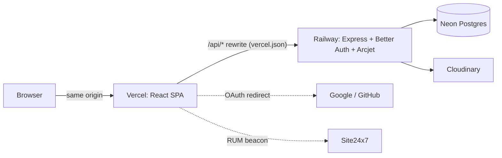

# Academic Hub

The dashboard once reported 2 classes in one card and 29 in the chart directly beside it — same page, same request. This repository is what it took to make that impossible, and to keep it that way.

Academic Hub is a university management dashboard — departments, subjects, classes, faculty, enrollments — built as a public demo. Every visitor signs in with Google or GitHub and gets their own disposable Postgres-backed workspace, seeded with a year of generated history, that expires and deletes itself on a timer. Nobody shares data with anybody else, and nothing a visitor does is permanent.

## Live

**App:** https://ums-pern-stack.vercel.app
**API:** https://ums-pern-stack.up.railway.app

Sign in with Google or GitHub. You'll land on a freshly seeded workspace — departments, subjects, classes, a full faculty/student roster, and a year of enrollment history — that resets on its own after an hour.

## Stack

| Tool | What it does here |
|---|---|
| React 19 + Refine | SPA shell; resource-driven CRUD (`dataProvider`/`authProvider` contracts), server-side table state |
| shadcn/ui + Radix | UI primitives, owned in-repo (`src/components/ui/`), not a versioned dependency |
| Express 5 | API server, one middleware chain resolving auth → rate limit → workspace scope |
| Better Auth | Google/GitHub OAuth, sessions, account linking |
| Drizzle ORM | Schema, versioned migrations, typed queries against Postgres |
| Neon | Serverless Postgres, scale-to-zero |
| Arcjet | Bot detection, shield, three separate rate-limit tiers |
| Cloudinary | Image storage/transformation/delivery for banners and avatars |
| Site24x7 | RUM on the frontend, APM Insight on the backend |
| Vercel + Railway | Frontend hosting + `/api` rewrite; backend hosting + daily cron |

## Architecture



The browser only ever talks to the Vercel origin. `vercel.json` rewrites `/api/*` to Railway transparently, so the session cookie is first-party from the browser's perspective even though the two services live on different domains — see the engineering notes for why that distinction is the whole ballgame on iOS.

## What's actually interesting here

- **Provisioning is one transaction, not three separate commits** — a crash mid-seed used to leave a workspace that existed but wasn't fully seeded; now it's atomic, with `seeded_at` written last as the completion marker.
- **A frontend/backend split-domain deploy breaks cookies on iOS Safari**, because of a constraint most people never hit: you cannot set `Domain=.vercel.app`, because `vercel.app` is on the Public Suffix List. The fix is an origin-level rewrite, not a cookie flag.
- **The KPI cards and the capacity chart used to disagree** because one was a period count wearing a "Total" label and the other was an actual total. Now both are built from literally the same base query.
- **A seed generator with a stored, replayable seed** — every workspace's "random" data is `faker.seed(n)` under the hood, and `n` is written to the row, so any data-shaped bug can be reproduced exactly.
- **`origin` defaults to `'user'`, not `'seed'`**, on every visitor-writable table — so a write path that forgets to set it fails toward "gets cleaned up," never toward "becomes permanent by accident."
- **Read scope comes from the session, never the request body or a role check** — one middleware, `req.workspaceId`, and a cross-workspace lookup returns `404`, not `403`, so existence itself isn't leaked.
- **Rate limiting isn't the correctness defense for provisioning — idempotency is.** A limit that can strand a legitimate user retrying mid-provision is a bug, not a feature; the limit only spends budget on an actual new seed.

Full writeup, in build order, with root causes and the options considered for each: [`docs/ENGINEERING-NOTES.md`](docs/ENGINEERING-NOTES.md).

## Running locally

Prerequisites: Node.js, a Neon (or any Postgres) database, a Google OAuth client, a GitHub OAuth App, an Arcjet key, a Cloudinary account.

### Backend

```bash
cd classroom_project/classroom-backend
npm install
cp .env.example .env
npm run db:migrate
npm run dev              # http://localhost:8000
```

| Env var | Purpose | Where to get it |
|---|---|---|
| `DATABASE_URL` | Postgres connection string | Neon console → Connect |
| `GOOGLE_CLIENT_ID` / `GOOGLE_CLIENT_SECRET` | Google OAuth | Google Cloud Console → Credentials |
| `GITHUB_CLIENT_ID` / `GITHUB_CLIENT_SECRET` | GitHub OAuth | github.com/settings/developers |
| `ADMIN_EMAILS` | Comma-separated emails auto-granted `admin` on sign-up | — |
| `BETTER_AUTH_SECRET` | Session/cookie signing secret | any random string |
| `FRONTEND_URL` | Required in production; Better Auth's `baseURL` | your deployed frontend origin |
| `ARCJET_KEY` | Rate limiting / bot detection | Arcjet dashboard |
| `CLOUDINARY_CLOUD_NAME` / `CLOUDINARY_API_KEY` / `CLOUDINARY_API_SECRET` | Signed server-side Cloudinary access | Cloudinary console |
| `PORT` | Optional; Railway sets this dynamically | — |

### Frontend

```bash
cd classroom_project/classroom-frontend
npm install
npm run dev               # http://localhost:5173, proxies /api to :8000
```

Needs `VITE_BACKEND_BASE_URL`, `VITE_CLOUDINARY_CLOUD_NAME`, `VITE_CLOUDINARY_UPLOAD_PRESET`, and `VITE_CLOUDINARY_UPLOAD_URL` set locally (no `.env.example` is checked in on the frontend side — copy the names above into your own `.env`).

## Testing

There is no wired `npm test` (`package.json`'s `test` script is a placeholder that exits 1). What exists instead is a set of 16 standalone verification scripts in `classroom-backend/src/scripts/` — `verify-*.ts`, run manually with `npx tsx src/scripts/<name>.ts` against a real database — each proving one specific invariant (seed-plan sanity, KPI/capacity parity, row-quota enforcement, workspace-provisioning race safety, Arcjet tier thresholds) rather than a conventional unit-test suite. Run any of them directly; none are wired into CI.

## Deployment

Frontend (Vercel) and backend (Railway) are two independently deployed services on different registrable domains. `vercel.json` rewrites `/api/*` to the Railway URL so the browser only ever sees one origin — this is required, not optional, for the session cookie to be first-party. If you fork this: update the Railway URL in `vercel.json`, set `FRONTEND_URL` on the backend to your Vercel domain, and register that same origin's `/api/auth/callback/google` and `/api/auth/callback/github` as the OAuth redirect URIs with Google and GitHub — miss any one of these three and sign-in strands users on the backend's bare root route.

## Known limitations

- No custom domain — the frontend/backend split lives on `vercel.app`/`up.railway.app`, both on the Public Suffix List, so the origin-rewrite proxy is the permanent architecture, not a workaround pending a real fix.
- No automated test suite or CI gate — correctness is enforced by runtime invariant checks (`GET /workspace/health`) and manually-run verification scripts, not a pipeline.
- Provisioning runs synchronously inside the request — no queue, so a burst of first-time sign-ins competes for the same request/response cycle as everything else.
- Single-region Postgres (Neon, no read replicas).
- Row-count quotas (500/table/workspace) are a blunt cost control, not a real usage-based one.

## Author

Barinder Singh — [GitHub](https://github.com/berryO307)
