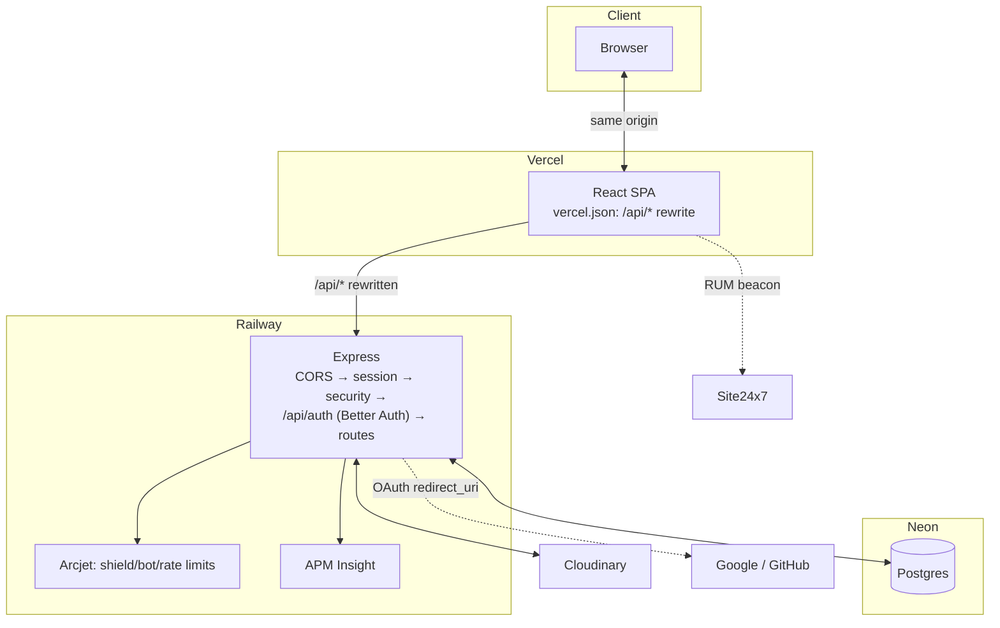

# Academic Hub — Engineering Notes

Sourced from git history (`git log`), migration files and their journal timestamps, `classroom_project/FINDINGS.md`, and the code itself. See the Coverage section at the end for what could and couldn't be verified this way.

---

## 1. Why this stack doesn't break

The claim isn't "these are good tools." It's narrower: **each tool in this stack removes one specific category of failure**, and an application assembled without it has to reimplement that guarantee by hand — which most projects don't, which is why they break in ways nobody can reproduce.

### PostgreSQL / Neon — invalid states become unrepresentable, not just unlikely

**What it does here:** every visitor-writable table (`departments`, `subjects`, `classes`, `enrollments`) carries a `workspace_id` foreign key to `demo_workspaces.id` with `ON DELETE CASCADE` (`db/schema/app.ts`), so deleting a workspace row deletes everything scoped to it in one statement — no orphan-sweep job needed. `classes.capacity` has a `CHECK (capacity >= 0)`. `classes.invite_code` has `CHECK (invite_code ~ '^[A-Z]{3}[0-9]{3}$')`. Uniqueness that used to be global (`departments.code`, `subjects.code`, `classes.invite_code`) is now workspace-scoped composite unique indexes (`departments_workspace_id_code_unique`, etc., migration `0006_step2_add_workspace_scoping.sql`) — two different workspaces can both have a department coded `CS`, because uniqueness only means something within one workspace's own catalog.

**What breaks without it:** validation living only in application code means every new write path is a fresh chance to write a bad row. A second route handler that forgets the capacity check, a script that inserts a class with a malformed invite code, a future contributor who doesn't know the workspace-scoping convention — all of these currently fail at the database, loudly, at write time. Without the constraints, the same mistakes silently succeed and the bad data surfaces later, disconnected from its cause.

**Beyond the defaults:** the invite-code format constraint (`0007_invite_code_format_check.sql`) was added `NOT VALID` deliberately — existing rows predated it and used a different format (7-char lowercase base36), and rather than backfill them, the migration's own comment grandfathers them in ("every non-permanent workspace self-heals within an hour via lazy expiry + reseed with the new generator"), trusting the workspace TTL to age out the exception instead of a data migration. Neon's own operational shape matters too: it's serverless Postgres with scale-to-zero and storage that includes change history — which is why the cron sweep (`cron-sweep.ts`) runs once daily rather than continuously; the correctness-critical cleanup (a user's own expired workspace) already happens lazily on the request path (`resolveWorkspace` in `lib/workspace.ts`), so the cron job is a backstop for workspaces nobody ever revisits, not a hot loop that would fight scale-to-zero.

### Drizzle ORM — schema as a versioned, reviewable artifact

**What it does here:** `drizzle-kit generate` turns schema changes (`src/db/schema/*.ts`) into timestamped, numbered SQL files in `drizzle/` (10 of them, `0000_closed_butterfly.sql` through `0009_skinny_moondragon.sql`, tracked in `drizzle/meta/_journal.json` with real millisecond timestamps), and `drizzle-kit migrate` applies them in order. Queries are typed against the same schema definitions — `db.select().from(classes).where(eq(classes.workspaceId, ...))` fails to compile if a column is renamed, rather than failing at runtime in production.

**What breaks without it:** schema drift between dev/staging/prod, and DDL applied by hand through a console that nobody wrote down — six months later, no one can tell you which environment is actually running which shape of the `enrollments` table, or reconstruct how it got there.

**Beyond the defaults:** migration `0006_step2_add_workspace_scoping.sql` opens with `TRUNCATE TABLE "departments", "subjects", "classes", "enrollments" RESTART IDENTITY CASCADE` and a comment explaining why: adding `NOT NULL workspace_id` columns to tables whose existing rows predate the workspace model and have nothing to backfill into required clearing them first, "agreed with the project owner ahead of this migration." That's a genuinely irreversible step recorded permanently in the migration history — the honest artifact of a real schema pivot, not smoothed over.

### Express / Node — one place to get workspace scope right, not N places to get it wrong

**What it does here:** `src/index.ts`'s middleware order is explicit and linear: CORS → session lookup (`sessionMiddleware`, populates `req.user` from the Better Auth cookie) → global security rules (`securityMiddleware`) → `/api/auth/*` handed to Better Auth directly (rate-limited) → `express.json()` → the seven resource routers. Inside each router, `requireAuth`/`requireAdmin` (`middleware/authorize.ts`) gate who can call a route at all, and `workspaceMiddleware` (`middleware/workspace.ts`) resolves `req.workspaceId` from the session in exactly one function — every route handler that needs workspace scope reads `req.workspaceId!`, never re-derives it.

**What breaks without it:** one handler that forgets to filter by workspace is a cross-tenant data leak — another visitor's classes, students, or enrollments showing up in your own workspace's list. With scope resolved once and injected, a handler literally cannot "forget" in a way that produces unscoped data; it can only use the wrong variable name, which is a different, much smaller class of bug.

**Beyond the defaults:** cross-workspace access returns `404`, not `403` — e.g. `routes/classes.ts`'s update handler does `.where(and(eq(classes.id, classId), eq(classes.workspaceId, req.workspaceId!)))` and treats zero rows as "No class found," identical to the row genuinely not existing. A `403` would confirm the row exists somewhere, just not accessible to you; `404` reveals nothing about other workspaces at all.

### React + Refine — CRUD as a contract, not bespoke fetch logic per screen

**What it does here:** every resource (`dashboard`, `departments`, `subjects`, `faculty`, `enrollments`, `classes`, `users` — `App.tsx`) is declared once with its list/create/edit/show routes, and `useTable` (via `@refinedev/react-table`) drives server-side pagination, filtering, and sorting through the shared `dataProvider` (`providers/data.ts`, built on `@refinedev/rest`'s `createDataProvider`). `authProvider` (`providers/auth.ts`) is the other half of the contract — `login`/`logout`/`check`/`getIdentity`/`onError`, each a small function Refine calls at the right moment, not scattered auth checks per page.

**What breaks without it:** bespoke fetch-and-filter logic in every list component, usually filtering client-side against whatever page happened to load — which silently breaks the moment there's more than one page of data, since the filter only ever sees what's already in memory. Loading and error states end up handled differently, inconsistently, screen by screen.

**Beyond the defaults:** page-level scope (Faculty's `role=teacher`, the Total Students KPI card's `role=student`) travels through Refine's `meta` parameter rather than `filters` — a comment in `providers/data.ts` explains why: `pages/users/list.tsx`'s own filter-popover controls use `filters`, and if the page-level scope also lived there, the two would collide.

### shadcn/ui + Radix — components you own, not a black-box dependency

**What it does here:** 46 components live directly in `src/components/ui/` (`button.tsx`, `dialog.tsx`, `table.tsx`, and so on) — generated once via the `shadcn` CLI (listed in `package.json` as a tool, not a runtime import) and then edited in place like any other repo code. Radix supplies the accessible primitives underneath (focus traps in dialogs, ARIA roles, keyboard navigation) that these components wrap.

**What breaks without it:** hand-rolled `
`-based menus, dialogs, and dropdowns that look right and fail keyboard navigation, or drift visually from each other because there's no shared token system — one button slightly the wrong shade of blue on one page.

**Beyond the defaults:** design tokens are CSS variables, so theming is single-source — see the mobile-sidebar and capacity-chart fixes later in this document, both of which were CSS layout bugs specific to *this* component tree's flex/grid ancestry, not generic shadcn defaults; owning the components in-repo is what made them fixable at all.

### Better Auth — OAuth without hand-rolled tokens

**What it does here:** `lib/auth.ts` configures Google and GitHub as the only sign-in methods (`emailAndPassword: { enabled: false }`), sessions lasting 7 days, and cookie attributes (`SameSite=Lax; Secure`, host-only — no `Domain` attribute) set explicitly rather than left to inference.

**What breaks without it:** a hand-rolled token scheme almost always means a JWT or session id in `localStorage`, readable and exfiltratable by any XSS on the page — Better Auth's cookie is `httpOnly` by construction, invisible to page JavaScript entirely.

**Beyond the defaults:** `account.accountLinking` is configured *without* `trustedProviders`, and the comment explains exactly why — reading Better Auth's own `oauth2/link-account.mjs` showed that listing a provider in `trustedProviders` skips checking the *incoming* sign-in's own `emailVerified` flag, gating only on the *existing stored* account's verification. Left at the library's default (require verified on both sides), which closes a real account-linking gap — a GitHub account with an unverified email claiming a real user's address could otherwise merge into that user's account. `databaseHooks.user.create.before` also throws a clear `APIError` if a provider hands back no email at all, rather than letting `ADMIN_EMAILS.includes(user.email.toLowerCase())` crash on `null`.

### Arcjet — the API edge decides before your handler runs

**What it does here:** `config/arcjet.ts` sets up shield + bot detection + a 25-req/2s sliding window globally; three more specific tiers layer on top — `authRateLimit.ts` (10/min per IP, fixed window, on `/api/auth/*`), `workspaceProvisionRateLimit.ts` (10/hour per user, token bucket, only spent on an actual provision), and `domainWriteRateLimit.ts` (20/min per user, token bucket, on writes to the four domain tables).

**What breaks without it:** one script hammering `POST /workspace` or the auth endpoints fills the database or exhausts OAuth provider quota; nothing at the API edge would stop it.

**Beyond the defaults — the actual thesis of this section:** the provisioning limit was deliberately raised from 3/hour to 10/hour, and the comment in `workspaceProvisionRateLimit.ts` states the reasoning directly: *"Idempotency ... is the actual defence against repeated calls now, not this limit — a workspace either fully exists or doesn't, so calling `POST /workspace` any number of times is safe."* A rate limit that can strand a legitimate user retrying mid-provision (a handful of tabs, a reconnect right at expiry) is a bug wearing a security feature's clothes. `routes/workspace.ts` checks `hasValidWorkspace()` first and only spends provisioning budget when a real seed is about to happen — a plain "give me my existing workspace" call is free.

### Cloudinary — a `public_id`, not a URL, is the stored fact

**What it does here:** `lib/cloudinaryClient.ts` on the backend holds the signed API credentials (never shipped to the browser); the frontend's `lib/cloudinary.ts` builds delivery URLs at render time — `f_auto,q_auto,c_fill,w_${width},dpr_auto/${publicId}` for banners, `g_face` added for avatars so face-detection cropping doesn't cut off a head.

**What breaks without it:** storing a full delivery URL means every transformation choice (crop, format, quality) is baked in at upload time — changing them later means re-uploading, not editing a template string.

**Beyond the defaults:** the class-detail banner's fallback chain is three deep — the class's own uploaded banner, then its subject's uploaded image, then a *generated* banner (`buildSubjectBannerUrl`, a real Cloudinary-delivered image built by colorizing the account's own `sample` asset and overlaying the subject name as text) — so every class with a subject shows something real regardless of whether anyone's uploaded a photo yet. That generated fallback is also shared across every workspace via `seedWorkspace.ts`'s `fetchCatalogImages` — a real photo uploaded once into the admin's permanent workspace propagates by catalog code/name into every freshly-seeded workspace, without merging any of the actual student/enrollment data those workspaces don't share.

### Vercel + Railway — the cost of the split, not just the benefit

**What it does here:** the frontend (static React SPA) and backend (a stateful Express process that needs to stay warm for Postgres pooling and cron) scale and deploy independently — a frontend-only change redeploys in seconds without touching the API process.

**The cost, stated honestly:** this put the frontend and backend on different registrable domains (`vercel.app` vs `up.railway.app`). A session cookie set by the backend was, from the browser's perspective, third-party — and Safari's Intelligent Tracking Prevention (plus iOS Chrome, which is WebKit underneath regardless of branding) blocks third-party cookies by default. Real users on iPhone Safari signed in with Google and landed on the backend's bare root route with no session. The fix — an origin-level rewrite in `vercel.json` so the browser only ever talks to Vercel — is a direct architectural consequence of choosing two independently-hosted services instead of one. See §2 for the full incident.

### Site24x7 — knowing before someone tells you

**What it does here:** RUM on the frontend (`index.html`'s beacon snippet + `lib/rum.ts`'s wrapper around the beacon's public JS API) and APM Insight on the backend (`AgentAPI.config()`, the very first lines executed in `index.ts`). `lib/rum.ts` exposes `trackRumEvent`, `reportRumError`, `setRumUserId`, `endRumSession` — real custom events fire from 10 files across the frontend: `sign_in_started`, `workspace_provisioned`, `workspace_reset`, `subject_detail_query_loaded`, `department_detail_query_loaded`, `class_roster_query`/`class_roster_view_more`, and a filtered/unfiltered list-query pair.

**What breaks without it:** no signal for when p95 regresses, and "works on my machine" is the only available evidence for a bug report.

**Beyond the defaults:** `lib/rum.ts`'s own top comment documents that the beacon's event-tracking commands (`trackEvents`/`addEvent`) are inconsistently documented across Site24x7's own two reference pages, and were verified against both before being relied on — and that an earlier version of this file called a command (`endSession`) that doesn't exist in either reference and was silently a no-op, since an unrecognized beacon command fails silently rather than erroring.

### Layered enforcement — the actual argument

Pick any of these three invariants and it's enforced the same way, at all three layers, independently:

| Invariant | Database | Server | UI |
|---|---|---|---|
| A class's status is one of exactly three values | `class_status` Postgres enum — a fourth value is a type error at the column, not a runtime check | `classStatusEnum` in Drizzle's schema, the same three values, checked at insert/update | `class-status-badge.tsx`, one shared mapping module every list/detail page imports — no component can invent a fourth label |
| A row belongs to exactly one workspace, always | `workspace_id NOT NULL` + FK with `ON DELETE CASCADE` — an orphan row is structurally impossible | `workspaceMiddleware` resolves `req.workspaceId` once from the session; every query filters on it | Nothing in the UI ever passes a workspace id explicitly — it's never in a form, a URL param, or a request body |
| A class's invite code is always `AAA###` | `CHECK (invite_code ~ '^[A-Z]{3}[0-9]{3}$')` on the column itself | the code generator (`lib/inviteCode.ts`) only ever produces that shape | displayed and copy-pasted as-is; nothing reformats it client-side |

None of these three layers alone is sufficient — a UI convention can be bypassed by a script, a server check can be skipped by a forgotten code path, and a database constraint alone gives you a 500 error with no context for the person who tripped it. Together, they're what makes this degrade predictably instead of failing in a way nobody can reproduce.

---

## 2. Feature chronology

Reconstructed from `git log --reverse` (121 commits, 30 merged PRs) and, for anything a commit message doesn't explain, from `FINDINGS.md` and the code itself. Routine CRUD pages aren't entries here — a page isn't a decision.

### 1. Project scaffold
**When** — 2026-07-26 to 2026-08-09 (`d04d3a2` through `75e869b`) **Area** — infra

**What it does** PERN split into `classroom-backend`/`classroom-frontend`; Refine + shadcn on the frontend, Express + Drizzle on the backend; a REST data provider (`0751c7b feat: implement data provider`, corrected the next day per Claude Code review feedback — `8ecea2b`) and the first database schema (`cf05ca5`, refined again in `96de2a9`).

**Why built this way** A framework (Refine) over hand-rolled CRUD screens, and typed migrations (Drizzle) over hand-written DDL, from the very first commits — not retrofitted later.

**Options considered** A hand-rolled REST client per resource was the alternative to Refine's `dataProvider` contract; rejected because it means re-solving pagination/filtering/sorting per screen instead of once. A schema-less/raw-SQL approach was the alternative to an ORM; rejected for the same reason migrations exist at all — undocumented schema drift between environments.

**What shipped** `classroom-backend/`, `classroom-frontend/`, initial Drizzle schema, `providers/data.ts`.

**The guard** None yet at this stage — this is the scaffold the later invariants get built on top of.

### 2. Cloudinary image integration
**When** — 2026-08-15 (`6cf4e29`) **Area** — data/UI

**What it does** An unsigned upload widget on the frontend for banners/avatars.

**Why built this way** Unsigned uploads keep the Cloudinary API secret off the client entirely — the widget only needs a public cloud name and an upload preset, both safe to ship in `VITE_`-prefixed env vars.

**Options considered** A signed-upload flow (backend mints a signature per upload) was the alternative; rejected at this stage for simplicity, though the backend later does gain signed server-side access (`cloudinaryClient.ts`) for admin/scripted operations that the unsigned widget can't do (search/enrich existing assets).

**What shipped** `upload-widget.tsx`, `@cloudinary/react` dependency.

**The guard** None described in the commit; the later `imageCldPubId`-over-URL convention (see §1, Cloudinary) is what actually protects this from drifting.

### 3. Arcjet security middleware
**When** — 2026-08-16 (`c591b57`) **Area** — infra/security

**What it does** First Arcjet integration — shield, bot detection.

**Why built this way** Bot/abuse protection at the API edge, before any route-specific logic runs.

**Options considered** Hand-rolled IP-based rate limiting (an in-memory counter, or a Redis-backed one) was the obvious alternative; rejected in favor of a managed service that also does bot detection and shield rules, which an in-memory counter can't.

**What shipped** `config/arcjet.ts`, `middleware/security.ts`.

**The guard** Activated fully in `cd1c6a1 fix: activate Arcjet protection and populate req.user` five days later — the first pass didn't yet gate real traffic.

### 4. Better Auth + Site24x7
**When** — 2026-08-16 (`686bc63`, `51d2d91`, `97c661b`) **Area** — auth/observability

**What it does** Better Auth wired in; APM Insight (backend) and RUM (frontend, `97c661b`, two days later) both added.

**Why built this way** Auth and observability landed early, before the feature surface grew large enough that retrofitting either would mean touching every route/page.

**Options considered** A custom JWT/session implementation was the alternative to Better Auth; rejected per §1's reasoning (token storage/XSS exposure). A homegrown error/perf-logging shim was the alternative to Site24x7; rejected for lack of real-user (not just server-side) visibility.

**What shipped** `lib/auth.ts` (early form), `index.html`'s RUM beacon, `AgentAPI.config()` in `index.ts`.

**The guard** None yet — the account-linking gap and the cookie-domain issue (both real, both fixed) hadn't been introduced yet at this point in history.

### 5. Public sign-up → guest mode → social-only auth
**When** — 2026-08-21, three stages in one day (`6e50289` credential login → `fd72a43` guest mode with write quotas → `85312bc`/`afb2fca`/`ecc1cdb` drop to social-only) **Area** — auth

**What it does / what was happening** The auth model was tried three different ways in quick succession: password-based sign-up first, then a sandboxed anonymous "guest" mode with write quotas and admin-only mutations, then — same day — guest mode itself was replaced by Google/GitHub-only sign-in.

**Why built this way** A public demo doesn't need password reset flows, email verification, or an email provider to run any of that — and an anonymous guest identity turned out to need its own quota/permission system that a real (if throwaway) identity gets for free.

**Options considered** Keeping guest mode alongside social login was considered and rejected — `afb2fca feat: switch to social-only auth, drop password reset/guest options` removed it outright rather than running both, since maintaining two parallel identity models (one with quotas bolted on, one without) is exactly the kind of forked logic that drifts.

**What shipped** `emailAndPassword: { enabled: false }` in `lib/auth.ts`; Google + GitHub as the only `socialProviders`.

**The guard** None of guest mode's write-quota code survives — it isn't a guard, it's the thing that got replaced by a cleaner model (per-workspace row quotas, §2 entry 9).

### 6. Ephemeral demo workspaces replace guest quotas
**When** — 2026-08-21 (`539ca34 feat: replace guest-mode write quotas with per-visitor demo workspaces`) **Area** — data/auth

**What it does** Every real (Google/GitHub) sign-in gets its own `demo_workspaces` row and a fully-seeded, isolated dataset, instead of one shared table with per-guest write quotas.

**Why built this way** A public demo with one shared dataset means every visitor sees everyone else's mutations — deleting a class, over-enrolling a section, whatever the last person did. Isolating by workspace removes that entirely, and expiring the workspace (not individual rows) means an active visitor's session can't be torn out from under them mid-use.

**Options considered** Soft-deleting old rows by age (a cron job deleting anything older than N hours) was the alternative; rejected because row-age deletion doesn't distinguish an active session's day-old data from an abandoned one's — it corrupts whoever's still using it. Per-workspace expiry, keyed to the workspace itself rather than any individual row's age, is what makes an active session safe regardless of how long it's been open.

**What shipped** `demo_workspaces` table (`0005_step1_drop_guest_mode.sql`), `workspace_id` scoping on every domain table (`0006_step2_add_workspace_scoping.sql`).

**The guard** The workspace-scoping unique indexes and cascade deletes described in §1.

### 7. `origin` column, defaulting to `'user'`
**When** — 2026-08-24 (`0009_add_origin_column.sql`) **Area** — data

**What it does** Every visitor-writable row (departments/subjects/classes/enrollments) carries an `origin` enum — `'seed'` or `'user'`.

**Why built this way** Distinguishes fixture data (safe to bulk-delete on reseed) from a visitor's own writes (needs its own flush path on sign-out, see `lib/cleanup.ts`'s `flushVisitorRows`).

**Options considered** A boolean `isFixture` flag was the simpler alternative; the two-value enum was kept instead because a third state (e.g. "admin-curated") was already foreseeable given the admin's manually-augmented permanent workspace, and an enum extends without a column-type change. The default direction was the real decision, though: defaulting to `'seed'` (so a write path has to opt in to being flushable) was rejected in favor of defaulting to `'user'` — the schema comment states the reasoning directly: "a write path that forgets to think about origin still fails safe (flushable), rather than silently becoming permanent."

**What shipped** `originEnum`, the default, and workspace_id+origin composite indexes on all four tables (`classes_workspace_id_origin_idx` etc.) so the flush queries stay fast.

**The guard** Routes build insert values from an explicit field list, never `req.body` spread directly — so a client can't smuggle `origin: 'seed'` into a request to make their own row un-flushable. `flushVisitorRows` in `lib/cleanup.ts`, called on sign-out and by the sweep job.

### 8. Seed generator: deterministic, back-dated, self-checking
**When** — first version 2026-08-21 (`2e99395 feat: add idempotent demo-data seed script`), rebuilt substantially through 2026-08-24 **Area** — data

**What it does** `seedWorkspace.ts` builds an entire fixture dataset — 7 departments, 16 subjects, 21 classes, a shared 140-student/13-teacher pool, and enrollments spread across 12 trailing months — from a `faker.seed(n)` call, where `n` is generated with `crypto.randomInt` and persisted on the `demo_workspaces` row (`seed_value` column).

**Why built this way** "Random-looking" demo data that's actually reproducible: if a data-shaped bug shows up in one workspace, re-seeding with the same stored value reproduces the exact same dataset to debug against, rather than a fresh random one that might not exhibit the bug at all.

**Options considered** Static fixture data (a single hand-written dataset every workspace gets a copy of) was the alternative; rejected because it can't vary — every workspace would look identical, and the 12-month enrollment trend chart would be the exact same shape everywhere, an obvious tell. Random data with no stored seed was the other alternative; rejected because it's not reproducible — a bug seen once could never be seen again on demand.

**What shipped** `generateSeedPlan` (in-memory plan first, validated, only then written — "so a failed sanity check never leaves a partially-seeded workspace behind"); `assertSeedPlanSanity`, which hard-fails the whole plan (not a warning) if: any row is dated after "now", fewer than 5/5 capacity-fill buckets are represented, fewer than 12/12 trailing months have an enrollment, or the four KPI counts (classes/subjects/students/faculty) aren't pairwise distinct.

**The guard** `assertSeedPlanSanity` itself, re-run on every seed attempt (`MAX_PLAN_ATTEMPTS = 5`, retrying with `seed + 1` on failure) — a bad plan is regenerated, never shipped. `verify-seed-plan.ts` re-derives the same checks independently from persisted rows as a second, standalone confirmation.

### 9. Per-workspace row quotas
**When** — 2026-08-22 (`a291e7d feat: add per-workspace row quotas (500/table)`) **Area** — infra/cost

**What it does** `middleware/rowQuota.ts`'s `enforceRowQuota` blocks a `create` once a workspace's table hits 500 rows; a narrower `enforceVisitorEnrollmentQuota` caps self-enrollment specifically at 25 (409, not 429 — "won't clear until the workspace flushes or resets," not a time-based limit).

**Why built this way** The 1-hour workspace TTL bounds *time*, not row count within that hour — a scripted loop could still spam-create for 59 minutes straight before expiry cleaned it up.

**Options considered** Relying on the TTL alone was the status quo before this; rejected once it was clear TTL only bounds time, not volume. A global (not per-workspace) row cap was considered and rejected — it would let one abusive workspace starve every other visitor's quota.

**What shipped** `ROW_QUOTA_PER_TABLE = 500`, `VISITOR_ENROLLMENT_QUOTA = 25`.

**The guard** `verify-row-quota.ts`.

### 10. Three-tier Arcjet rate limiting
**When** — 2026-08-22 (`7530112 feat: add three-tier Arcjet rate limiting for auth, provisioning, and domain writes`) **Area** — infra/security

**What it does** Splits rate limiting into three separately-tuned tiers instead of one blanket rule — see §1's Arcjet subsection for the exact values and the provisioning tier's later 3/h → 10/h revision.

**Why built this way** Auth churn, an expensive provisioning operation, and routine domain writes have very different legitimate request volumes; one shared limit is either too loose for auth or too tight for a normal editing session.

**Options considered** One global per-user rate limit across all endpoints was the simpler alternative; rejected because it can't be tuned per risk/cost — the number that's generous for "editing a class" is dangerous for "provisioning a whole workspace."

**What shipped** `authRateLimit.ts`, `workspaceProvisionRateLimit.ts`, `domainWriteRateLimit.ts`.

**The guard** `verify-arcjet-tiers.ts` (with a documented, out-of-scope pre-existing off-by-one in its Tier-1 auth-window assertion, per `FINDINGS.md`).

### 11. Cross-origin cookie / dynamic-PORT split-domain fixes
**When** — 2026-08-22 (`5171437`, `98bd0e1`) **Area** — infra

**What it does** Two Railway-specific fixes landed together: binding Express to `0.0.0.0` (Railway's proxy couldn't reach a loopback-only bind, despite the process reporting "listening" fine) and using Railway's dynamically-assigned `PORT` env var instead of a hardcoded one.

**Why built this way** Both are the class of bug that only exists once you deploy to a real PaaS — invisible in local dev, where `localhost:8000` binds however you like.

**Options considered** For the bind address: leaving the implicit default (loopback-scoped) and trusting the "Server listening on port 8000" log line as proof of reachability was the status quo — rejected once it was clear that log line doesn't actually mean Railway's proxy can reach the process; a container can report itself listening while only accepting connections on an interface the external proxy never touches. Explicit `0.0.0.0` was the fix — binds every interface, standard for containerized deployments. For the port: hardcoding `8000` was the status quo — rejected because Railway assigns the listening port dynamically via its own `PORT` env var and routes external traffic to whatever the app actually binds, so a hardcoded value silently stops receiving traffic in production while looking correct locally. Reading `process.env.PORT` with an `8000` fallback for local dev was the fix.

**What shipped** `app.listen(PORT, "0.0.0.0", ...)`.

**The guard** None beyond the fix itself; not the kind of thing a runtime assertion catches.

### 12. The count-contradiction: 2 classes in one card, 29 in the chart beside it
**When** — 2026-08-24 (`d990bcd feat: redesign dashboard KPIs and charts, fix KPI/capacity count mismatch`), investigated and documented in `FINDINGS.md` **Area** — data/UI

**What was happening** The dashboard's KPI card and its capacity-distribution chart, built from the same request, disagreed. `FINDINGS.md`'s own evidence: `{ "total": "29", "this_month": "3", "last_month": "2" }` for classes — the chart summed all 29 rows (a true total); the KPI card showed only rows created in the current or prior calendar month (`2` or `3`, depending on when you looked), wearing a "Total" label it hadn't earned.

**Root cause** `routes/dashboard.ts`'s `classes_current`/`classes_previous` were period counts (`this_month`/`last_month`), not totals — confirmed by re-running the exact period query by hand and matching the app's own displayed numbers exactly. Ruled out first: a workspace-scoping mismatch (identical results with the filter removed, since only one workspace had real data at investigation time) and two structurally separate endpoints (both KPIs and the chart are computed inside the same `runSummaryQuery` function, one round trip).

**Options considered** Relabeling the card ("New this month") instead of changing its semantics was one option — rejected because the chart beside it is explicitly a total, and two different time semantics on the same dashboard, even correctly labeled, invites exactly this confusion again later. Making the chart also a period count was the other option — rejected because a capacity-distribution chart answering "how full are classes right now" has to reflect every class that currently exists, not just ones created recently.

**What shipped** KPI `value` redefined as the same unfiltered `count(*)`/`count(distinct ...)` the chart's own total is built from; `previous` redefined as that same total *as of the end of last month* (cumulative), so the delta is a real growth rate, not a category-mismatched flow metric. `classesCount` (the KPI) and the capacity buckets are now computed from the literal same base `classes` query in `routes/dashboard.ts`.

**The guard** `verify-kpi-capacity-parity.ts`, enforcing that the two numbers can't structurally drift apart again.

### 13. Charts measuring the wrong quantity: fill-rate as a monotonic total
**When** — 2026-08-24, same investigation as entry 12 **Area** — UI/data

**What was happening** The original fill-rate trend chart computed cumulative enrollments-to-date over capacity — a ratio that, by construction, can only ever climb, never fall, regardless of what's actually happening month to month.

**Root cause** A cumulative total dressed as a rate is a real smell: any month-over-month "trend" derived from it is meaningless, since the underlying number is monotonic by definition, not by anything happening in the data.

**Options considered** Smoothing or annotating the existing chart (e.g. showing the derivative) was one option — rejected as papering over a chart whose underlying metric was the wrong one to begin with. Rebuilding around a genuinely period-scoped metric (enrollments *created* within each calendar month, not cumulative-to-date) was the alternative taken.

**What shipped** `capacity-donut-chart.tsx`/`fill-rate-trend-chart.tsx` deleted; replaced by `capacity-bar-chart.tsx` (current point-in-time distribution across 5 fill buckets) and `enrollments-trend-chart.tsx` (a genuine per-month count, real month-to-month variation confirmed in `FINDINGS.md`: 25 to 210 enrollments across the 12 trailing months, not flat).

**The guard** Two real rendering bugs were caught and fixed during this same pass, both documented with DOM-level evidence in `FINDINGS.md`: the bar chart's numeric axis had no explicit `domain`, rendering bars at correct relative proportions but a near-zero absolute scale; the trend chart wasn't rendering at all because `flex-1` (`flex-basis: 0%`) resolved to a computed `0px` height in that component's specific flex ancestor chain, despite an explicit `h-64` class being present in source — "same class combination, different runtime outcome," per `FINDINGS.md`, "which is why code review alone didn't catch it."

### 14. OAuth landing on the backend's bare root route
**When** — 2026-08-24 (`656cbbd fix: proxy auth/data same-origin, fix OAuth redirect stranding on iOS`), investigated in `FINDINGS.md` **Area** — auth/infra

**What was happening** A real user report: signed in with Google on iPhone Safari, landed on `https://ums-pern-stack.up.railway.app/` — literally the text "Classroom backend is up and running!" — with no session established.

**Root cause, confirmed from source** No explicit `baseURL` on the `betterAuth({...})` call — Better Auth infers it from whatever host physically receives a request, which (once Vercel/the browser forwards through to Railway) resolved to the backend's own domain. Since the OAuth `redirect_uri` handed to Google is derived from `baseURL`, not the separate `callbackURL` param, the callback landed on Railway regardless of what post-login redirect the frontend had already configured. The auth client's own `baseURL` also pointed straight at Railway, so every auth call — not just the OAuth callback — went browser → Railway cross-origin. Confirmed by reading `classroom-frontend/src/providers/auth.ts`'s existing comment on this exact failure mode, and `classroom-backend/src/lib/auth.ts` as it stood before the fix.

**Options considered** Setting `SameSite=None; Secure` more carefully (the standard cross-site cookie fallback) was the surface-level fix considered and rejected — Safari's ITP (and iOS Chrome, WebKit-based regardless of name) blocks third-party cookies by default, and a cookie set by a different registrable domain than the page the browser is looking at *is* third-party no matter how `SameSite`/`Secure` are configured. Making the cookie first-party via an origin-level proxy was the fix actually shipped, because it addresses the actual constraint rather than working around it.

**What shipped** `vercel.json`'s `/api/(.*)` rewrite to Railway, ahead of the SPA catch-all; `vite.config.ts`'s equivalent dev-server proxy; `baseURL: process.env.FRONTEND_URL` set explicitly on the backend with a startup guard that throws if it's missing or still `localhost` in production; cookie attributes changed to `SameSite=Lax` (correct now that everything is same-origin); `GET /` on the backend now redirects to the frontend instead of showing a bare status string, and a catch-all does the same for any other stray HTML navigation.

**The guard** The `FRONTEND_URL` startup guard in `lib/auth.ts` (`throw new Error(...)` if missing/localhost in production) — this class of misconfiguration now fails at boot, not silently at OAuth time.

### 15. Third-party cookies and the Public Suffix List
**When** — same investigation as entry 14 **Area** — infra

**What was happening** Once the cookie issue above was traced to "different registrable domains," the obvious next question was whether a shared parent domain could fix it directly (e.g. both services under one custom domain's subdomains, with `Domain=.example.com` on the cookie).

**Root cause / the actual constraint** `vercel.app` and `up.railway.app` are both entries on the Public Suffix List — the list browsers use to know where a "domain" legally ends and a registrable name begins (it's why `Domain=.co.uk` isn't a thing you can set either). Because both hosting platforms' default domains are themselves on that list, `Domain=.vercel.app` is not a valid cookie scope the browser will honor; there is no cookie-attribute-level fix available at all on the default platform domains. This is what makes the story a real one rather than "just configure `SameSite` correctly" — the obvious fix genuinely doesn't exist without a custom domain.

**Options considered** A custom domain with both services as subdomains (`app.example.com`, `api.example.com`) would make `Domain=.example.com` valid and solve this at the cookie-attribute level directly — the correct long-term fix, not implemented here (see Known gaps). The same-origin reverse proxy (`vercel.json` rewrite) was chosen as the fix that works entirely on the free default domains, with no purchase/DNS step required.

**What shipped** Same as entry 14 — the `/api/*` proxy is the fix for both the redirect-stranding bug and the third-party-cookie constraint simultaneously.

**The guard** None beyond the proxy itself being the permanent architecture, not a stopgap — see Known gaps for the honest framing.

### 16. Account linking without `trustedProviders`
**When** — same investigation as entry 14, documented in `FINDINGS.md` **Area** — auth/security

**What was happening** While investigating the OAuth redirect bug, reading Better Auth's account-linking source surfaced an unrelated but real gap: `trustedProviders: ["google", "github"]` was set.

**Root cause, confirmed from source** `node_modules/better-auth/dist/oauth2/link-account.mjs`'s linking guard: `if (!isTrustedProvider && !userInfo.emailVerified || requireLocalEmailVerified && !dbUser.user.emailVerified || ...) { block }`. With both providers listed as trusted, `isTrustedProvider` is `true`, which short-circuits the first clause to `false` regardless of the *incoming* sign-in's own `emailVerified` status — only the existing stored account's verification still gates linking.

**Options considered** Leaving `trustedProviders` as-is (the status quo, presumably set for convenience) was rejected once the takeover vector was clear: a GitHub account with an unverified email claiming a real user's address could link into that user's account, provided the existing account already had `emailVerified: true`. Removing `trustedProviders` and relying on Better Auth's default (require verified on *both* sides) was the fix — both providers already report `emailVerified` accurately (Google's `id_token` claim, GitHub's own `/user/emails` `verified` flag), so this closed the gap "with no functional loss," per `FINDINGS.md`.

**What shipped** `trustedProviders` removed from `account.accountLinking` in `lib/auth.ts`.

**The guard** None beyond the config change itself and the explanatory comment left in place — no automated test exercises account-linking specifically (see Known gaps).

### 17. GitHub null-email handling
**When** — same investigation as entry 14 **Area** — auth

**What was happening** The brief this investigation was responding to specifically asked whether a GitHub account with a private/unlisted primary email would break sign-up.

**Root cause / what was actually found** Reading the installed Better Auth GitHub provider source (`@better-auth/core/src/social-providers/github.ts`, version 1.6.29 at the time) showed it already requests `["read:user", "user:email"]` by default and calls `GET https://api.github.com/user/emails`, falling back to the primary (or first) verified address when the main profile response omits one — this is exactly what the brief asked for, already implemented in the library, not something this project needed to build. What genuinely was missing: a guard for the even rarer case of *no* verified email existing at all (entry 16's `databaseHooks.user.create.before` throw), since `ADMIN_EMAILS.includes(user.email.toLowerCase())` would otherwise crash on a `null` email rather than fail with a clear message.

**Why this passes in testing and fails (or would fail) in production** No GitHub account exists in the real seeded/live data to have exercised the private-email path for real — confirmed via `FINDINGS.md`'s direct query, `account provider_id distribution: [{ provider_id: 'google', n: '2' }]`, zero GitHub rows. Local testing with a developer's own GitHub account (which typically has a public or at least verified primary email) would never hit the fallback path at all — it only matters for a GitHub user who has specifically set their email to private, which requires a second real GitHub account with that setting to genuinely exercise.

**Options considered** Reimplementing the emails-API fallback at the application layer (fetching `/user/emails` directly in `databaseHooks` and picking a verified address before Better Auth ever saw the profile) was one option — rejected once reading the installed provider source confirmed the library already does exactly this, which would have meant duplicating (and maintaining, and risking drifting from) logic the dependency already owns. Leaving `ADMIN_EMAILS.includes(user.email.toLowerCase())` to crash on the genuinely-no-verified-email edge case was the other option, i.e. doing nothing — rejected because it fails as an unhandled exception with no actionable message rather than a clear one; the guard added in entry 16 throws a specific `APIError` instead.

**What shipped** The `databaseHooks.user.create.before` guard from entry 16's fix.

**The guard** None that exercises the actual private-email GitHub path — documented honestly in `FINDINGS.md` as unverified against real data, and still true here (see Known gaps).

### 18. Non-atomic provisioning, proven with a real forced-failure test
**When** — 2026-08-24 (`10afc50 fix: atomic + idempotent demo workspace provisioning`), investigated in `FINDINGS.md`'s "Demo workspace provisioning integrity" section **Area** — data

**What was happening** A brief hypothesized a truncated/partial-seed bug (H1: a claimed 228-vs-140-student gap) and role-based read filtering hiding data (H2). Neither reproduced against live data — the 228 figure belonged to the admin's separately hand-augmented permanent workspace, not a truncated seed of the standard one; all real non-admin workspaces were mutually consistent (140/13/21/16); every workspace's KPI `previous` value was directly queried and found non-zero; grepping every route handler for role-based read-filtering predicates found zero matches.

**Root cause of the *real*, separate risk found in the same investigation** `provisionWorkspace` ran the workspace-row insert, `seedWorkspace()` (many individually-committing inserts), and the final `seededAt` update as three separate, non-transactional steps. Nothing ever retried a partial result, and `resolveWorkspace` treated any existing non-expired row as valid regardless of whether `seededAt` was set.

**Options considered** Leaving the three-step flow and adding a repair job that periodically re-checks every workspace was one option — rejected because it only bounds *how long* a broken workspace could be visible, not whether one could exist at all; a visitor could still land on a half-seeded workspace between provisioning and the next repair run. Wrapping the entire flow in a single transaction was the fix taken — proven, not just asserted, with a deliberate forced-failure test: a `Proxy`-wrapped transaction client throwing on the 3rd class insert during a real `provisionWorkspace` call. Result, per `FINDINGS.md`: zero rows survived, confirming the rollback actually works rather than merely looking correct on the happy path.

**Why it required a driver change** `drizzle-orm/neon-http` (the original driver) throws `"No transactions support in neon-http driver"` on any `db.transaction()` call, confirmed by reading the installed package's own compiled `dist/neon-http/session.js` before attempting to build on top of it. Switched to `drizzle-orm/neon-serverless` + `@neondatabase/serverless`'s WebSocket `Pool` — real interactive transactions, with no cold-start tradeoff since Railway already runs this backend as a long-lived process, not a serverless function.

**What shipped** `provisionWorkspace` wrapped in one `db.transaction`; `seededAt` written last, inside that same transaction, as the completion marker; `resolveWorkspace` treats `seededAt === null` as equivalent to expired — delete and silently re-provision on the next request that touches it.

**The guard** `checkWorkspaceInvariants` (`lib/workspace.ts`) — seeded, every domain table non-empty with no future-dated rows, all 5 capacity buckets populated, all 12 trailing months covered, the 4 KPI counts pairwise distinct, no orphaned `workspace_id`-null rows system-wide — exposed as `GET /workspace/health` and backing `backfill-workspace-invariants.ts`, run dry-run-first against live data specifically to confirm it wouldn't misjudge the admin's hand-curated permanent workspace as broken, before being run for real (`Healthy: 4. Repaired: 0. Unrepairable: 0.`).

### 19. Idempotency replaces rate limiting as provisioning's correctness defense
**When** — same investigation as entry 18, "C4" **Area** — infra/data

**What it does** Covered in depth in §1's Arcjet subsection — `hasValidWorkspace()` checked before spending any provisioning rate-limit budget, and the limit itself raised 3/h → 10/h.

**Why built this way / options considered** Keeping the limit at 3/h and adding a way to "reset" a stuck user's budget on request was one option — rejected as treating the symptom; a legitimate user shouldn't be able to get stuck in the first place. Removing the rate limit on provisioning entirely was the other option — rejected because the underlying seed operation is genuinely expensive (~950 rows) and worth bounding against actual abuse, just not at a threshold a normal multi-tab visitor could hit by accident.

**What shipped / the guard** See entry 18 and §1.

### 20. Read visibility conflated with write permission — and why it wasn't the bug
**When** — same investigation as entry 18 (H2) **Area** — data/security

**What it does / what was happening** The brief's H2 hypothesized that role-based filtering on reads was hiding data from non-admin visitors. Grepping every backend route handler for role-based read-filtering predicates found zero matches — reads are gated by `requireAuth` (any signed-in user, scoped to their own workspace) uniformly; only *writes* additionally require `requireAdmin` where that's the intended model (e.g. `routes/users.ts`'s `POST`/`PUT`/`DELETE`).

**Why role-filtering reads inside a single-tenant disposable workspace buys nothing** Every visitor's workspace already contains only their own fixture data — there's no second tenant's data present to filter *away* from a non-admin viewer within one workspace. A role-based read filter would only ever have something to hide if multiple identities shared a workspace with genuinely different permissions on the same rows, which this architecture doesn't have; ownership (which workspace a row belongs to) is the only access boundary that means anything here, and it's already enforced at the middleware/query layer described in §1.

**Options considered** Adding role-scoped read filters preemptively (in case H2 turned out to be real, or to be defensive against a future version of it) was one option — rejected once the grep came back empty and the ownership model was understood, since building a defense against a bug that doesn't exist, and can't exist given the single-tenant-per-workspace model, is speculative work with no invariant behind it. Leaving the ownership-based access model as the sole boundary and documenting the non-finding was the other option, and the one taken — because the workspace-scoping invariant already fully explains why H2 has nothing to attach to.

**What shipped** Nothing — this entry exists because "we checked and it wasn't the bug" is itself a documented finding, not a silent non-event.

**The guard** N/A by design — see above.

### 21. Real accounts leaking into the public roster
**When** — 2026-08-25 (`f0fb5d2 fix: exclude real accounts from the public users/faculty/students list`) **Area** — data/privacy

**What was happening** A real user report: friends who signed in with their own Google accounts to try the demo had their real name and email visible to every other visitor in the Students/Faculty list.

**Root cause** `GET /users` (which both the Faculty and Students pages reuse, filtered by a `role` query param) queried the raw `user` table with no distinction between the seeded fixture pool and real OAuth sign-ins — every real account, including the admin's own, was globally visible to any other authenticated visitor.

**Options considered** Filtering by `role !== 'admin'` was one option — rejected because it would still expose non-admin real accounts (the actual friends who signed in), which is precisely the leak being fixed. Adding an explicit `isFixture` boolean column to `user` and backfilling it was the other option — rejected in favor of a signal that already existed and required no schema change: fixture users are inserted directly by the seed script and never get a matching `account` row, since only a real OAuth sign-in creates one.

**What shipped** `NOT EXISTS (SELECT 1 FROM account WHERE account.user_id = user.id)` applied to both the list/count query and the `GET /users/:id` detail lookup, so a real account can't be reached by guessing its id either.

**The guard** Verified against live data at fix time: of 311 total `user` rows, exactly 6 were hidden — confirmed to be the real accounts reported, with the other 305 fixture rows untouched.

### 22. Mobile UI: sidebar drawer, pinned table columns, chart labels
**When** — 2026-08-24 to 2026-08-25 (`fee321f`, `57ad8fa`, and later unmerged commits `e02543b`/`84487ba` on `fix/shared-images-and-mobile-polish`) **Area** — UI

**What it does / what was happening** A cluster of related mobile-specific bugs: charts forcing horizontal page overflow, a mobile sidebar `Sheet` drawer (fixed at `18rem`/288px) never closing after a nav-link click — on a ~390px phone, leaving only ~100px of the destination page visible behind it, which read as a broken/squeezed "show" page rather than what it actually was; and a capacity-chart bar label combining count and percentage into one string whose widest case could exceed its reserved margin.

**Root cause, each confirmed rather than guessed** The overflow bug: flex/grid items default to `min-width: auto`, so a wide descendant (a Recharts SVG) forces its container wider than intended unless `min-w-0` is set explicitly. The sidebar bug: simple arithmetic once the Sheet's fixed width was known — no click handler ever called `setOpenMobile(false)`. The chart-label bug: the combined `"21 · 100%"`-style label had no guaranteed-safe width against its fixed margin.

**Options considered** For the sidebar, leaving navigation to close the drawer implicitly (relying on the route change alone) was the status quo, and it doesn't work — a route change and a Sheet's own open state are unrelated pieces of state unless explicitly wired together. The fix wires `onClick` on every nav link to call `setOpenMobile(false)` when on mobile. For the chart label, shortening vs. widening the reserved margin were the two options; shortening (percentage-only, count still available via tooltip and the accessible table) was chosen since it also improves legibility on a narrow card generally, not just prevents overflow.

**What shipped** `min-w-0` on chart containers; `setOpenMobile(false)` wired into every sidebar nav link's `onClick`; percentage-only bar labels with a trimmed margin.

**The guard** None automated — these are layout bugs a snapshot/visual-regression test would catch and this repo doesn't have one (see Known gaps).

### 23. UX defect classes: unhide, confirm-before-destroy, honest empty states
**When** — ongoing, most concentrated 2026-08-21 (`31a0e38 fix: detail-page UI bugs`) **Area** — UI

**What it does** Every destructive action in the UI (unenrolling a student, deleting a user) is behind an `AlertDialog` confirmation, not a bare button — confirmed in `pages/classes/show.tsx` and `pages/users/list.tsx`. The shared `DataTable` component (`components/refine-ui/data-table/data-table.tsx`) distinguishes two states that look the same at a glance but mean different things: genuinely no data yet ("No {noun} yet — this table is empty for the time being") versus an active filter that happens to match nothing ("No results match your filters," with a clear-filters action).

**Why built this way** A destructive action with no confirmation step is a slip away from data loss; a table that goes blank identically whether it's actually empty or just filtered reads as broken either way, and a demo specifically needs the "your filter matched nothing" case to not look like the seed data silently vanished.

**Options considered** A single generic "No data" empty state (the simpler implementation) was the alternative; rejected because it makes a filtered demo table look broken rather than working-as-filtered — exactly the confusion the two-state version exists to prevent.

**What shipped** `AlertDialog`-gated destructive actions; `DataTableNoData`'s `hasActiveFilters`-branched copy and action.

**The guard** None automated; these are UI conventions enforced by the shared `DataTable`/`AlertDialog` components being the only path to building a list page or a destructive action, not by a test.

---

## 3. Cross-cutting invariants

| Invariant | Enforced | Prevents |
|---|---|---|
| Workspace scope comes from the session, never the request body | `middleware/workspace.ts`, one function, `req.workspaceId` | A client passing a different workspace id and reading/writing someone else's data |
| Reads are scoped by workspace, not by role | Every route's `WHERE workspace_id = req.workspaceId` | Speculative role-based filtering with nothing real to filter (§2 entry 20) |
| `origin` defaults to `'user'` on every visitor-writable table | Column default in `db/schema/app.ts`; routes build inserts from an explicit field list, never spread `req.body` | A forgotten write path becoming permanently un-flushable instead of failing toward cleanup |
| Provisioning is atomic and idempotent | Single `db.transaction` in `provisionWorkspace`; `seededAt` as the completion marker; `resolveWorkspace` re-provisions on `seededAt === null` | A visitor ever observing a half-seeded workspace |
| Class status is exactly one of three values, everywhere | Postgres `class_status` enum + Drizzle enum + one shared UI mapping module | A fourth, invented status appearing in any one layer |
| Cross-workspace access returns `404`, not `403` | `WHERE id = X AND workspace_id = req.workspaceId!` combined in one query | Confirming a row's existence in a workspace you can't access |
| No row is ever dated after "now" | `assertSeedPlanSanity` hard-fails the seed plan; `checkWorkspaceInvariants`' `*_not_future` checks | Future-dated rows breaking relative-time UI and inflating current-period KPI counts (a real bug found and fixed, `FINDINGS.md`) |
| KPI counts have one source; components never recompute the same number twice | `classesCount` and the capacity-bucket chart share the same base `classes` query in `routes/dashboard.ts` | The count-contradiction bug (§2 entry 12) recurring |

---

## 4. Architecture

### One request lifecycle: sign-in through first dashboard render

1. **Browser → Vercel.** User clicks "Sign in with Google" on `/login` (`pages/login`). `authProvider.login` (`providers/auth.ts`) calls `authClient.signIn.social({ provider: "google", callbackURL: `${window.location.origin}/` })` — an absolute frontend URL, resolved at redirect time.
2. **Vercel → Railway, transparently.** The auth client's own `baseURL` is `window.location.origin`, so the browser's request for the OAuth kickoff goes to the Vercel origin, which `vercel.json` rewrites to Railway. The browser never learns Railway's domain exists.
3. **Railway → Google.** Better Auth (`lib/auth.ts`, `baseURL: process.env.FRONTEND_URL`) builds the `redirect_uri` from that explicit `FRONTEND_URL`, not from whichever host physically received the request — so the value Google redirects back to is the frontend's own `/api/auth/callback/google`, still routed through the same rewrite.
4. **Google → Railway (via the rewrite) → session cookie set.** Better Auth exchanges the code, creates/links the `user`/`account`/`session` rows (`databaseHooks.user.create.before` runs here, checking for a null email and `ADMIN_EMAILS`), and sets the session cookie — `SameSite=Lax`, host-only, first-party because the browser only ever saw the frontend's origin.
5. **Browser → Railway, dashboard load.** `sessionMiddleware` (`middleware/session.ts`) reads the cookie via `auth.api.getSession`, populates `req.user`. `workspaceMiddleware` (`middleware/workspace.ts`) calls `resolveWorkspace(req.user.id, isAdmin)`.
6. **Workspace resolution.** If no workspace exists, or the existing one is expired or has `seededAt === null`, `provisionWorkspace` runs — one transaction: insert the `demo_workspaces` row, run `seedWorkspace` (departments → subjects → classes → the shared teacher/student pool via `upsertFixtureUsers` → enrollments), write `seededAt` last. `req.workspaceId` is set either way.
7. **Data fetch.** The frontend's `useDashboardSummary` hook (`useCustom` under Refine) hits `GET /api/dashboard/summary`, scoped by `req.workspaceId!` throughout `runSummaryQuery` — KPIs, capacity buckets, the enrollments trend, and recent activity, all from one round trip.
8. **Render.** `pages/dashboard.tsx` renders the KPI cards, `capacity-bar-chart.tsx`, `enrollments-trend-chart.tsx` — each RUM-instrumented (`trackRumEvent`) to record that the query actually completed, not just that the component mounted.

---

## 5. Known gaps

- **No custom domain.** The frontend/backend split lives on `vercel.app`/`up.railway.app`, both on the Public Suffix List — the `/api/*` rewrite is the permanent fix for the third-party-cookie constraint, not a stopgap pending a "real" fix at the cookie-attribute level. A custom domain (subdomains under one registrable name) is the only way to make `Domain=.example.com` a valid cookie scope, and it isn't set up.
- **No automated test suite wired into CI.** `npm test` is a placeholder (`echo "Error: no test specified" && exit 1`). What exists instead is 16 standalone `verify-*.ts`/`backfill-*.ts` scripts under `classroom-backend/src/scripts/`, each run manually against a real database to prove one specific invariant — real, but not gated by anything on push or merge.
- **The GitHub private-email path has never been exercised against real data.** Confirmed correct by reading Better Auth's provider source (§2 entry 17), but zero GitHub accounts exist in the live database to have tested it for real.
- **No dedicated concurrency test for provisioning at production-realistic scale.** `verify-workspace-provisioning-race.ts` exists and fires 8 concurrent `resolveWorkspace()` calls for one new user, asserting exactly one workspace survives — a real test, but its own comment states plainly: "not part of an automated suite (none exists in this repo yet)," and 8 is not the 10 originally scoped in the provisioning-integrity investigation.
- **Provisioning is synchronous, inside the request/response cycle.** No queue — a burst of first-time sign-ins each pay the full seed cost (~950 rows) inline. Acceptable at current demo traffic; wouldn't be at meaningfully higher concurrency.
- **Row-count quotas (500/table/workspace, 25 self-enrollments) are a blunt, static cost control**, not usage-based or configurable per environment.
- **Single-region Postgres**, no read replicas — fine for a low-traffic public demo, a real limitation if traffic grew geographically distributed.
- **The E4 gap from the provisioning investigation** — refreshing a user's name/avatar on every sign-in, not just the first link — is left unfixed and documented as such in `FINDINGS.md`: Better Auth's own linking code only refreshes profile fields on a *new* provider link, and no hook in this version covers "every sign-in, same provider" without patching library internals.
- **No visual-regression testing.** Every mobile CSS bug in §2 entry 22 was found by a real user report or manual inspection, not caught before shipping.

---

## Coverage

**Read in full:** `git log --reverse` (121 commits, 30 merged PRs); `classroom_project/FINDINGS.md` (all four of its investigation sections); every migration file in `drizzle/` and `drizzle/meta/_journal.json`; the complete Drizzle schema (`db/schema/app.ts`, `auth.ts`, `workspace.ts`); `lib/auth.ts`, `lib/workspace.ts`, `lib/cleanup.ts`, `lib/cloudinaryClient.ts`; every file in `middleware/`; `index.ts`; `config/arcjet.ts`; the top ~70 lines and the sanity-assertion logic of `lib/seedWorkspace.ts` (687 lines total — not read line-by-line in full, but its structure, constants, and every `throw`/assertion site were); `App.tsx`; `providers/data.ts` (partially — the `buildQueryParams` logic, not every endpoint's field mapping) and `providers/auth.ts` in full; `vercel.json`, `vite.config.ts`; `lib/rum.ts` in full plus a grep of every call site; `cron-sweep.ts`; `src/scripts/verify-workspace-provisioning-race.ts` in full, the rest of the 16 scripts by filename/purpose only, not read line-by-line.

**Could not be verified from the repository alone, and is flagged rather than asserted:** PR descriptions/discussion (no `gh` CLI available in this environment — chronology is reconstructed from commit messages and merge-commit branch names only, which is a real but thinner source than PR bodies would have been); anything about actual production traffic, load, or performance numbers (no dashboard/metrics export was available to read — the "what's measured" claims in this document are about *instrumentation existing*, not about specific observed values); whether the 8 unmerged commits on `fix/shared-images-and-mobile-polish` as of this writing (`e02543b`, `84487ba`, `d78a268`, `bc7ab89`) have been merged to `main` by the time this is read — §2 entry 22 and its neighbors describe what the code does, not a claim about what's currently deployed.
